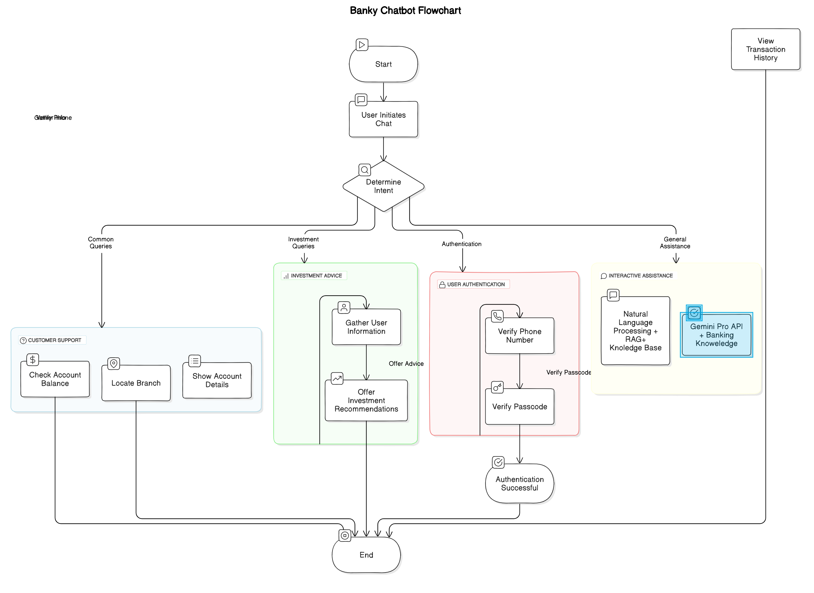
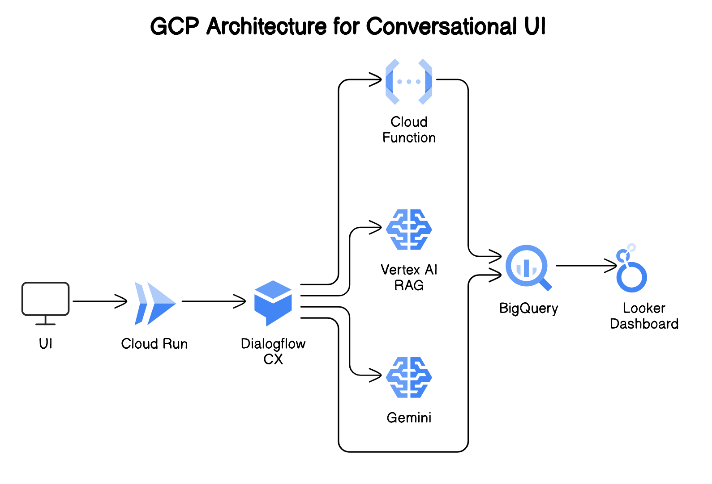

#  Banky: Your AI-Powered Banking Assistant

Our idea revolves around creating an AI-powered ecosystem for the banking
and financial services sector, aimed at providing comprehensive enhancing customer experience through personalized interactions,automated, intelligent, efficient solutions to common queries and tasks and  optimizing growth through data-driven insights and sustainable practices. Leveraging cutting-edge technologies such as Google Cloud, Dialogflow CX,
Vertex AI, Gemini Pro, and more, our solution integrates various use cases to offer
a seamless experience to customers.

## What it does
Banky is an AI-powered banking assistant designed to handle a variety of banking tasks and provide personalized financial advice. Key features include:
- **Customer Support:** Addressing common banking queries such as checking account balances, viewing transaction histories, and locating branches.
- **Investment Advice:** Gathering user information to offer tailored investment recommendations based on their goals, risk tolerance, and preferences.
- **User Authentication:** Ensuring secure access by verifying user identity through phone numbers and passcodes.
- **Interactive Assistance:** Engaging with users through natural language processing to understand and respond to their needs efficiently.

## How we built it
We built Banky using the following technologies and tools:
- **Google Cloud Vertex AI:** For developing and deploying machine learning models that power Banky's natural language processing and decision-making capabilities.
- **Dialogflow CX:** To create an intuitive conversational interface that handles user interactions and routes queries to appropriate intents.
- **Google Cloud Functions:** For backend integration, handling user authentication, and fetching data from banking systems.
- **Python and Flask:** For developing server-side logic and integrating various components of the application.

## Challenges we ran into
- **Data Security:** Ensuring that user data is handled securely and in compliance with financial regulations.
- **Natural Language Understanding:** Training the AI to accurately understand and respond to a wide range of user queries and intents.
- **Integration with Banking Systems:** Seamlessly integrating Banky with existing banking infrastructure and APIs to provide real-time information and services.
- **Personalization:** Balancing the need for personalized advice with the privacy concerns of users, ensuring data is used responsibly.

## Accomplishments that we're proud of
- **Seamless Integration:** Successfully integrating multiple technologies to create a cohesive and responsive AI assistant.
- **User-Centric Design:** Developing an intuitive interface that makes banking tasks simpler and more accessible for users.
- **Advanced AI Capabilities:** Leveraging Vertex AI to build sophisticated models that enhance the chatbot's understanding and response accuracy.
- **Secure Authentication:** Implementing a robust authentication flow to protect user data and ensure secure access to banking services.

## What we learned
- **AI and ML Integration:** Gained deeper insights into integrating AI and machine learning models into practical applications.
- **User Experience:** The importance of designing user-centric interfaces that cater to the diverse needs of banking customers.
- **Security Best Practices:** Enhanced our understanding of security protocols and best practices in handling sensitive financial data.
- **Continuous Improvement:** The need for continuous learning and iteration to improve AI models and user interactions over time.

## What's next for Banky: Your AI-Powered Banking Assistant
- **Enhanced Financial Advice:** Expanding the range of financial advice Banky can provide, including more detailed investment strategies and retirement planning.
- **Multilingual Support:** Adding support for multiple languages to cater to a broader audience.
- **Voice Interaction:** Incorporating voice recognition capabilities to enable hands-free banking interactions.
- **Expanded Services:** Integrating more banking services such as loan applications, credit score monitoring, and budget planning tools.
- **User Feedback Loop:** Implementing a feedback mechanism to gather user input and continuously improve Banky's performance and user satisfaction.