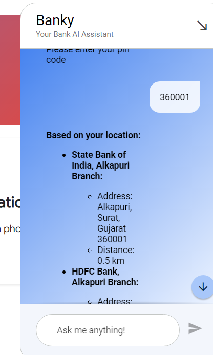

# Banky :- AI Powered Chatbot

## Light Mode


## Dark Mode


## Test cases


Creating test cases for the Banky chatbot involves defining scenarios to ensure it correctly handles user interactions and responses. Here are several test cases covering different functionalities and edge cases based on the provided dialogue.

### Test Case 1: Welcome Message

**Test Case ID:** TC001  
**Description:** Verify the welcome message.  
**Steps:**
1. User initiates conversation with "Hello".
**Expected Result:**
- Banky responds with "Welcome! I'm Banky, your virtual banking guide. Whether you need account information, transaction assistance, or product recommendations, I've got you covered."


### Test Case 2: Request for Account Info

**Test Case ID:** TC002  
**Description:** Verify account information request process.  
**Steps:**
1. User selects "Account Info".
**Expected Result:**
- Banky responds with "Sure, I can help you with that. Please provide your registered phone number."


### Test Case 3: Phone Number Entry

**Test Case ID:** TC003  
**Description:** Verify phone number entry.  
**Steps:**
1. User enters "9879461956".
**Expected Result:**
- Banky responds with "Thank you. Now, please enter your 5-digit passcode".


### Test Case 4: Passcode Entry

**Test Case ID:** TC004  
**Description:** Verify passcode entry.  
**Steps:**
1. User enters "98794".
**Expected Result:**
- Banky responds with "Account Details", followed by account information.


### Test Case 5: Account Details

**Test Case ID:** TC005  
**Description:** Verify account details display.  
**Steps:**
1. User is authenticated.


**Expected Result:**
- Banky displays:
  ```
  Account No:- ACC901901
  Account Status :- active
  ```


### Test Case 6: Request for Branch Location

**Test Case ID:** TC006  
**Description:** Verify branch location request process.  
**Steps:**
1. User selects "Find Branch Location".
**Expected Result:**
- Banky responds with "Please enter your pin code".


### Test Case 7: Pin Code Entry

**Test Case ID:** TC007  
**Description:** Verify pin code entry and branch location information.  
**Steps:**
1. User enters "360001".
**Expected Result:**
- Banky responds with branch location details:
  ```
  Based on your location:
  State Bank of India, Alkapuri Branch:
  Address: Alkapuri, Surat, Gujarat 360001
  Distance: 0.5 km
  HDFC Bank, Alkapuri Branch:
  Address: Alkapuri, Surat, Gujarat 360001
  Distance: 0.6 km
  ICICI Bank, Alkapuri Branch:
  Address: Alkapuri, Surat, Gujarat 360001
  Distance: 0.7 km
  Axis Bank, Alkapuri Branch:
  Address: Alkapuri, Surat, Gujarat 360001
  Distance: 0.8 km
  Bank of Baroda, Alkapuri Branch:
  Address: Alkapuri, Surat, Gujarat 360001
  Distance: 0.9 km
  Note: Distances are approximate and may vary depending on the exact location within 360001.
  ```



### Test Case 8: Invalid Phone Number

**Test Case ID:** TC008  
**Description:** Verify response to invalid phone number.  
**Steps:**
1. User enters an invalid phone number, e.g., "123".
**Expected Result:**
- Banky responds with an error message, asking to enter a valid phone number.


### Test Case 10: Invalid Pin Code

**Test Case ID:** TC010  
**Description:** Verify response to invalid pin code.  
**Steps:**
1. User enters an invalid pin code, e.g., "ABCDE".
**Expected Result:**
- Banky responds with an error message, asking to enter a valid pin code.


### Test Case 11: No Branches Found

**Test Case ID:** TC011  
**Description:** Verify response when no branches are found for a given pin code.  
**Steps:**
1. User enters a pin code with no branches, e.g., "000000".
**Expected Result:**
- Banky responds with "No branches found for the provided pin code."

### Test Cases for Banky: Investment Feature

#### Test Case 13: Investment Goal Query

**Test Case ID:** TC013  
**Description:** Verify response to user's primary financial goal query.  
**Steps:**
1. User selects "Investment".
2. Banky asks, "What is your primary financial goal right now?"
3. User responds with "investing for the future".
**Expected Result:**
- Banky acknowledges the response and proceeds to ask for the investment amount range.

#### Test Case 14: Investment Amount Range

**Test Case ID:** TC014  
**Description:** Verify response to user's investment amount range input.  
**Steps:**
1. Banky asks, "Provide ranges in your local currency."
2. User responds with "80000 INR".
**Expected Result:**
- Banky acknowledges the amount and proceeds to ask for current savings.

#### Test Case 15: Current Savings

**Test Case ID:** TC015  
**Description:** Verify response to user's current savings input.  
**Steps:**
1. Banky asks, "How much do you currently have in savings?"
2. User responds with "50000 INR".
**Expected Result:**
- Banky acknowledges the savings and proceeds to ask about spending habits.

#### Test Case 16: Spending Habits

**Test Case ID:** TC016  
**Description:** Verify response to user's spending habits input.  
**Steps:**
1. Banky asks, "How would you rate your spending habits?"
2. User responds with "Very disciplined".
**Expected Result:**
- Banky acknowledges the spending habits and proceeds to ask about investment risk comfort.

#### Test Case 17: Investment Risk Comfort

**Test Case ID:** TC017  
**Description:** Verify response to user's comfort with investment risk.  
**Steps:**
1. Banky asks, "How comfortable are you with investment risk?"
2. User responds with "moderate".
**Expected Result:**
- Banky acknowledges the risk tolerance and provides investment parameters.

#### Test Case 18: Display Investment Parameters

**Test Case ID:** TC018  
**Description:** Verify display of investment parameters based on user input.  
**Steps:**
1. User provides investment goal, amount, savings, spending habits, and risk tolerance.
**Expected Result:**
- Banky displays:
  ```
  Investment Parameters:
  Investment amount: INR 80,000
  Risk tolerance: Moderate
  Investment horizon: 5 years
  Discipline: Very disciplined
  ```

#### Test Case 19: Provide Investment Strategy

**Test Case ID:** TC019  
**Description:** Verify display of investment strategy based on parameters.  
**Steps:**
1. Banky acknowledges user inputs and displays an investment strategy.
**Expected Result:**
- Banky provides:
  ```
  Investment Strategy:
  1. Diversification:
     Crypto: 10% (INR 8,000)
     Stocks: 40% (INR 32,000)
     Gold: 20% (INR 16,000)
     FD: 30% (INR 24,000)
  2. Asset Allocation:
     Crypto (10%):
       Invest in a mix of established cryptocurrencies like Bitcoin and Ethereum.
       Consider using a crypto exchange or wallet that offers low fees and high security.
     Stocks (40%):
       Invest in a diversified portfolio of stocks across different sectors and industries.
       Consider investing in index funds or ETFs to reduce risk.
     Gold (20%):
       Invest in physical gold or gold ETFs.
       Gold provides a hedge against inflation and market volatility.
     FD (30%):
       Invest in a fixed deposit with a reputable bank.
       FDs offer a guaranteed return and low risk.
  ```

#### Test Case 20: Note on Investment Strategy

**Test Case ID:** TC020  
**Description:** Verify display of additional notes on investment strategy.  
**Steps:**
1. Banky displays the investment strategy.
**Expected Result:**
- Banky provides a note:
  ```
  Note:
  The investment amounts and percentages are suggestions based on the given parameters.
  Investors should adjust the allocation based on their individual circumstances and risk tolerance.
  It is important to regularly review and rebalance the portfolio to maintain the desired risk-return profile.
  ```

### Comprehensive Test Case Flow

1. **Initiate Investment Interaction:**
   - User selects "Investment".
   - Verify welcome message for investment guidance (TC013).

2. **Gather Investment Information:**
   - User provides investment goal (TC013).
   - User provides investment amount range (TC014).
   - User provides current savings (TC015).
   - User provides spending habits rating (TC016).
   - User provides comfort level with investment risk (TC017).

3. **Display Investment Plan:**
   - Verify display of investment parameters (TC018).
   - Verify display of detailed investment strategy (TC019).
   - Verify display of notes on the investment strategy (TC020).

By adding these test cases, we can comprehensively verify the functionality of the investment feature in Banky, ensuring it provides accurate and helpful financial advice based on user inputs.


